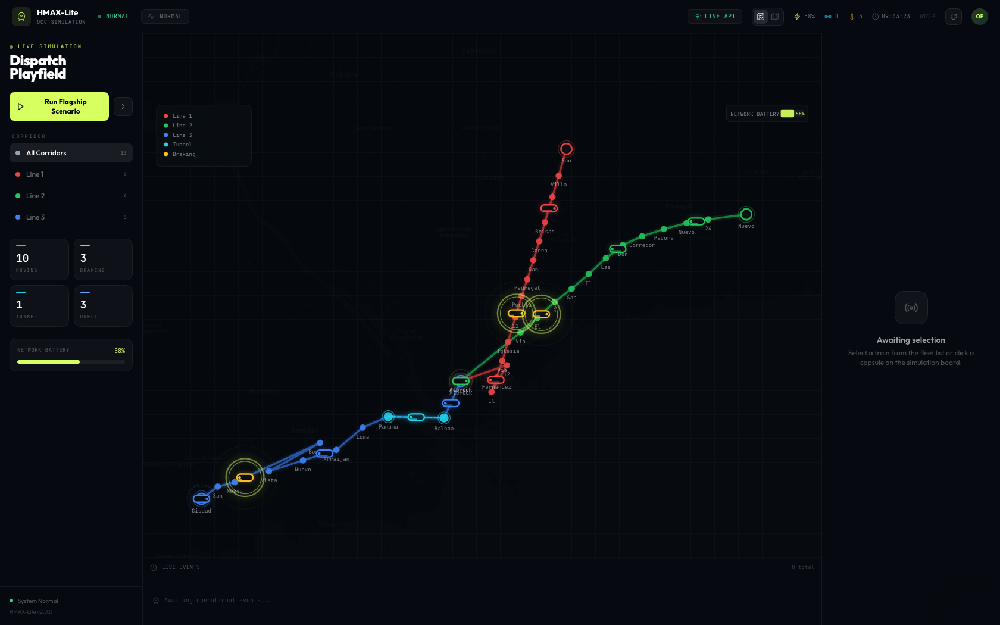
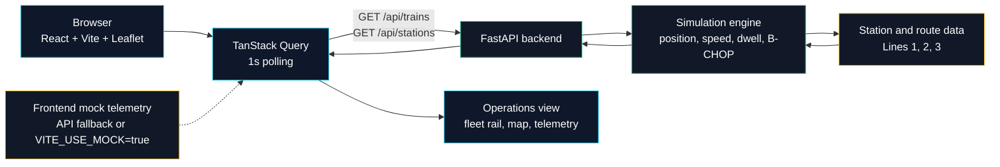
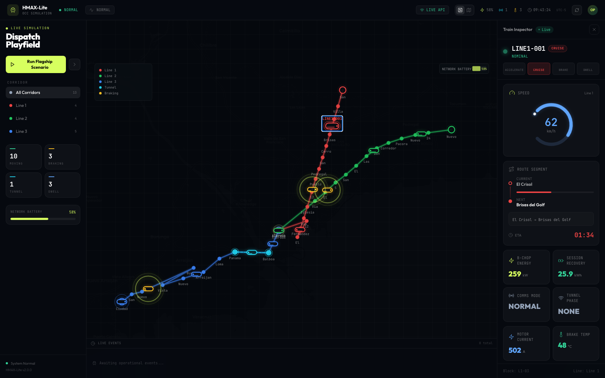
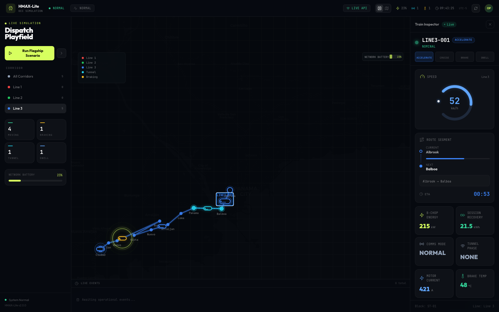
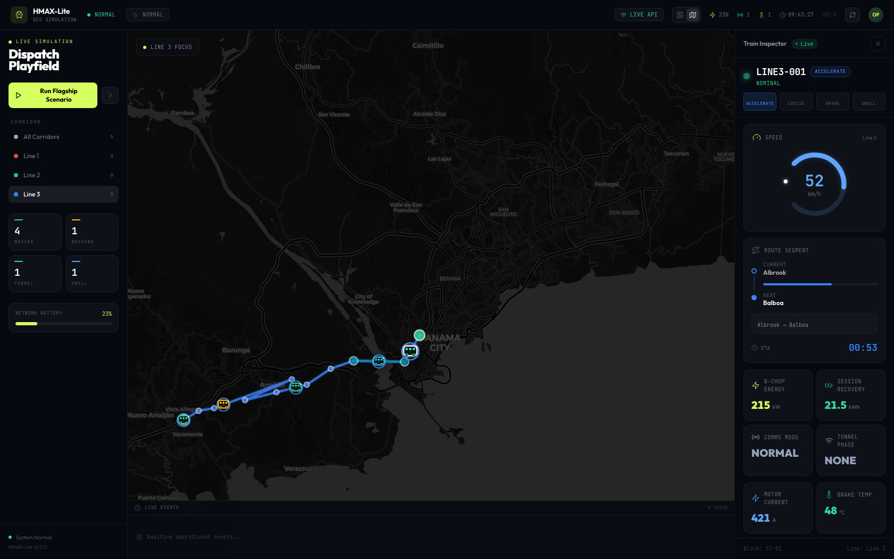

# HMAX-Lite: Panama Metro Digital Twin

<p align="center">
  
</p>

## 🚝 Project Overview

**HMAX-Lite** is a real-time SCADA (Supervisory Control and Data Acquisition) simulation designed to model the telemetry and operations of the **Panama Metro System**, including Lines 1, 2, and 3.

This project serves as a "Digital Twin" proof-of-concept for the **Hitachi Rail / HPH Consortium**, visualizing the movement of monorail and metro trainsets across all three lines:
- **Line 1** (Red): San Isidro ↔ Albrook (North-South)
- **Line 2** (Green): Nuevo Tocumen ↔ Albrook (East-West)
- **Line 3** (Blue): Albrook ↔ Ciudad del Futuro (Westbound)

### Key Engineering Challenges Addressed

| Challenge | Solution |
|-----------|----------|
| **Multi-Line Operations** | Unified dashboard supporting all 3 metro lines with 39 total stations |
| **Canal Tunnel Geofencing** | Dead-zone detection with `TUNNEL_RELAY` communication mode (Line 3) |
| **B-CHOP Energy Recovery** | Real-time regenerative braking telemetry simulation |
| **CBTC Moving Block** | Dynamic headway management between active trains |

---

## 🎯 Architecture



### Dashboard Screenshots

<p align="center">
  
</p>

<p align="center">
  <em>Full dashboard with 13 active trains across Lines 1, 2, and 3</em>
</p>

<p align="center">
  
</p>

<p align="center">
  <em>Train telemetry with speed gauge, energy chart, and route progress</em>
</p>

<p align="center">
  
</p>

<p align="center">
  <em>Line 3 filtered view showing tunnel detection and monorail fleet</em>
</p>

<p align="center">
  
</p>

<p align="center">
  <em>Leaflet map view with CartoDB dark tiles, route polylines, and train markers</em>
</p>

---

## ⚡ Key Features

### 1. 🚇 Multi-Line Metro Support

**Comprehensive Coverage:** All three Panama Metro lines with 39 stations total.

- **Line Selector:** Filter dashboard by individual line or view all lines simultaneously
- **Color-Coded Routes:** Each line has distinct color (Red/Green/Blue) for easy identification
- **Interchange Stations:** Albrook station serves as interchange for all three lines
- **Line-Specific Trains:** 13 total trains (4 on Line 1, 4 on Line 2, 5 on Line 3)

### 2. 🚇 Canal Tunnel "Dead Zone" Logic (Line 3)

**Engineering Context:** The 5.3km tunnel under the Panama Canal requires specific communication relays and safety protocols.

- **Geofence Detection:** System automatically detects when trains enter the zone between Balboa and Panama Pacifico
- **Visual Feedback:** Dashboard switches train status to `TUNNEL_MODE` with cyan indicators
- **Communication Mode:** Telemetry switches to `TUNNEL_RELAY` protocol simulation
- **Line-Specific:** Tunnel functionality only applies to Line 3 trains

### 3. 🔋 B-CHOP Energy Recovery Monitor

**Engineering Context:** Hitachi monorails utilize the B-CHOP (Brake CHOPper) system to capture regenerative braking energy.

- **Physics Simulation:** Deceleration triggers regenerative braking mode
- **Real-time Telemetry:** `energy_recovered_kwh` spikes during braking events
- **Temperature Monitoring:** Brake system temperature varies 40°C - 90°C

### 4. ⏱️ CBTC Moving Block Simulation

**Engineering Context:** Communications-Based Train Control (CBTC) enables safe, close-proximity train operations.

- **ETA Calculations:** Real-time "Next Station ETA" for each train
- **Headway Management:** Virtual spacing management between active trains
- **Speed Curves:** Realistic acceleration/deceleration profiles

---

## 🛠️ Tech Stack

| Layer | Technology | Purpose |
|-------|------------|---------|
| **Backend** | Python 3.11, FastAPI | Telemetry Engine, Physics Simulation |
| **Frontend** | React 18, Vite, TypeScript | HMI Dashboard |
| **Maps** | Leaflet, React-Leaflet | Geospatial Visualization |
| **Styling** | Tailwind CSS | Industrial Dark Mode UI |
| **State** | TanStack Query | Real-time State Sync |
| **Infra** | Docker, Docker Compose | Container Orchestration |

---

## 🚀 Quick Start

### Prerequisites

- Docker & Docker Compose v2.0+
- Node.js 18+ (for local development)
- Python 3.11+ (for local development)

### One-Command Launch

```bash
# Clone and start
git clone https://github.com/yourusername/hmax-lite.git
cd hmax-lite
docker-compose up --build
```

### Access Points

| Service | URL |
|---------|-----|
| **Operations Dashboard** | http://localhost:3000 |
| **API Documentation** | http://localhost:8000/docs |
| **Health Check** | http://localhost:8000/health |

---

## 📍 Route Data

### Line 1 (Red) - San Isidro ↔ Albrook

15 stations running North-South across Panama City.

| ID | Station | Coordinates | Type |
|----|---------|-------------|------|
| L1-01 | San Isidro (Terminal) | 9.0824, -79.4856 | Elevated |
| L1-02 | Villa Zaita | 9.0702, -79.4901 | Elevated |
| L1-03 | El Crisol | 9.0605, -79.4938 | Elevated |
| L1-04 | Brisas del Golf | 9.0489, -79.4982 | Elevated |
| L1-05 | Cerro Viento | 9.0402, -79.5015 | Elevated |
| L1-06 | San Antonio | 9.0315, -79.5050 | Elevated |
| L1-07 | Pedregal | 9.0228, -79.5085 | Elevated |
| L1-08 | Pueblo Nuevo | 9.0152, -79.5118 | Underground |
| L1-09 | 12 de Octubre | 9.0055, -79.5155 | Underground |
| L1-10 | Iglesia del Carmen | 8.9942, -79.5198 | Underground |
| L1-11 | Vía Argentina | 8.9855, -79.5232 | Underground |
| L1-12 | Fernandez de Cordoba | 8.9778, -79.5265 | Underground |
| L1-13 | El Ingenio | 8.9712, -79.5295 | Underground |
| L1-14 | 12 de Octubre (Interchange) | 8.9835, -79.5205 | Underground |
| L1-15 | Albrook (Interchange) | 8.9763, -79.5475 | At-Grade |

### Line 2 (Green) - Nuevo Tocumen ↔ Albrook

13 stations running East-West from Tocumen to Albrook.

| ID | Station | Coordinates | Type |
|----|---------|-------------|------|
| L2-01 | Nuevo Tocumen (Terminal) | 9.0525, -79.3802 | Elevated |
| L2-02 | 24 de Diciembre | 9.0502, -79.4025 | Elevated |
| L2-03 | Nuevo Tocumen | 9.0485, -79.4152 | Elevated |
| L2-04 | Pacora | 9.0458, -79.4285 | Elevated |
| L2-05 | Corredor Sur | 9.0425, -79.4412 | Elevated |
| L2-06 | Don Bosco | 9.0385, -79.4525 | Elevated |
| L2-07 | Las Mañanitas | 9.0325, -79.4625 | Elevated |
| L2-08 | El Doral | 9.0252, -79.4725 | Elevated |
| L2-09 | San Bernardino | 9.0185, -79.4825 | Elevated |
| L2-10 | 5 de Mayo | 9.0125, -79.4925 | Underground |
| L2-11 | El Carmen | 9.0052, -79.5025 | Underground |
| L2-12 | Vía España | 8.9985, -79.5125 | Underground |
| L2-13 | Albrook (Interchange) | 8.9763, -79.5475 | At-Grade |

### Line 3 (Blue) - Albrook ↔ Ciudad del Futuro

11 stations on the 25km monorail line to the west.

| ID | Station | Coordinates | Type |
|----|---------|-------------|------|
| ST-01 | Albrook (Terminal/Interchange) | 8.9763, -79.5475 | At-Grade |
| ST-02 | Balboa | 8.9594, -79.5573 | Underground ⚠️ |
| ST-03 | Panama Pacifico | 8.9600, -79.5900 | Elevated ⚠️ |
| ST-04 | Loma Cova | 8.9550, -79.6050 | Elevated |
| ST-05 | Arraijan | 8.9448, -79.6204 | Elevated |
| ST-06 | Nuevo Chorrillo | 8.9400, -79.6400 | Elevated |
| ST-07 | Vista Alegre | 8.9350, -79.6600 | Elevated |
| ST-08 | Burunga | 8.9480, -79.6300 | Elevated |
| ST-09 | Nuevo Arraijan | 8.9300, -79.6800 | Elevated |
| ST-10 | San Bernardino | 8.9280, -79.6900 | Elevated |
| ST-11 | Ciudad del Futuro | 8.9224, -79.6995 | Terminal |

> ⚠️ **Tunnel Section:** Line 3 stations ST-02 to ST-03 traverse the Canal Tunnel

---

## 📁 Project Structure

```
hmax-lite/
├── docker-compose.yml        # Container orchestration
├── backend/
│   ├── Dockerfile
│   ├── requirements.txt
│   ├── main.py               # FastAPI application
│   ├── simulator.py          # Physics & telemetry engine (multi-line)
│   ├── models.py             # Pydantic schemas
│   └── stations.py           # Route data (Lines 1, 2, 3)
├── frontend/
│   ├── Dockerfile
│   ├── package.json
│   ├── vite.config.ts
│   ├── tailwind.config.js
│   └── src/
│       ├── App.tsx               # Main dashboard layout
│       ├── components/
│       │   ├── Header.tsx         # Line selector & system status
│       │   ├── Map.tsx            # Multi-line Leaflet map
│       │   ├── TrainMarker.tsx    # Line-colored train SVG icons
│       │   ├── TrainList.tsx      # Fleet list grouped by line
│       │   ├── TelemetrySidebar.tsx # Full telemetry panel
│       │   ├── SpeedGauge.tsx     # SVG circular gauge
│       │   ├── EnergyChart.tsx    # Recharts area chart + temp gauge
│       │   ├── MetricsCard.tsx    # Reusable metric with sparkline
│       │   └── PageTransition.tsx # Animation wrappers
│       ├── hooks/
│       │   └── useTrains.ts       # Data fetching + mock fallback
│       ├── types/
│       │   └── train.ts           # MetroLine types & config
│       └── utils/
│           ├── api.ts             # API client with mock fallback
│           └── mockData.ts        # Realistic mock telemetry data
└── docs/
    ├── architecture.md
    └── screenshots/
        ├── dashboard-full.png
        ├── dashboard-telemetry.png
        ├── dashboard-line3.png
        └── dashboard-map.png
```

---

## 🔧 Development

### Backend (FastAPI)

```bash
cd backend
python -m venv venv
source venv/bin/activate
pip install -r requirements.txt
uvicorn main:app --reload --host 0.0.0.0 --port 8000
```

### Frontend (React + Vite)

```bash
cd frontend
npm install
npm run dev
```

---

## 📊 API Endpoints

| Method | Endpoint | Description |
|--------|----------|-------------|
| GET | `/health` | Service health check |
| GET | `/api/lines` | Get all metro lines info |
| GET | `/api/lines/{line_id}/stations` | Get stations for specific line |
| GET | `/api/trains` | Current state of all trains (optional `?line=` filter) |
| GET | `/api/trains/{id}` | Single train telemetry |
| GET | `/api/stations` | All stations across all lines |
| GET | `/api/stream` | SSE telemetry stream |

---

## 🎨 Line Colors

| Line | Color | Hex Code | Route |
|------|-------|----------|-------|
| Line 1 | Red | `#ef4444` | San Isidro ↔ Albrook |
| Line 2 | Green | `#22c55e` | Nuevo Tocumen ↔ Albrook |
| Line 3 | Blue | `#3b82f6` | Albrook ↔ Ciudad del Futuro |

---

## 👨‍💻 Author

**Angel Pinzon**  
Systems Engineer | Cloud Architecture & DevOps

- Portfolio: [apinzon.dev](https://apinzon.dev)
- LinkedIn: [linkedin.com/in/angelpinzon](https://linkedin.com/in/angelpinzon)

---

## ⚠️ Disclaimer

This is a personal project for educational and demonstration purposes. It is **not affiliated** with Metro de Panamá S.A., Hitachi Rail, or the HPH Consortium.

---

## 📄 License

MIT License - See [LICENSE](LICENSE) for details.
