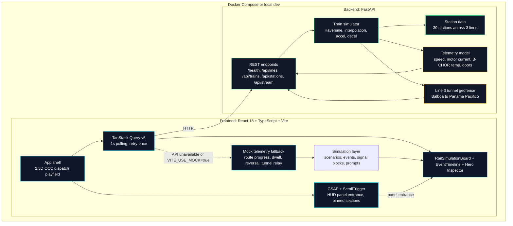
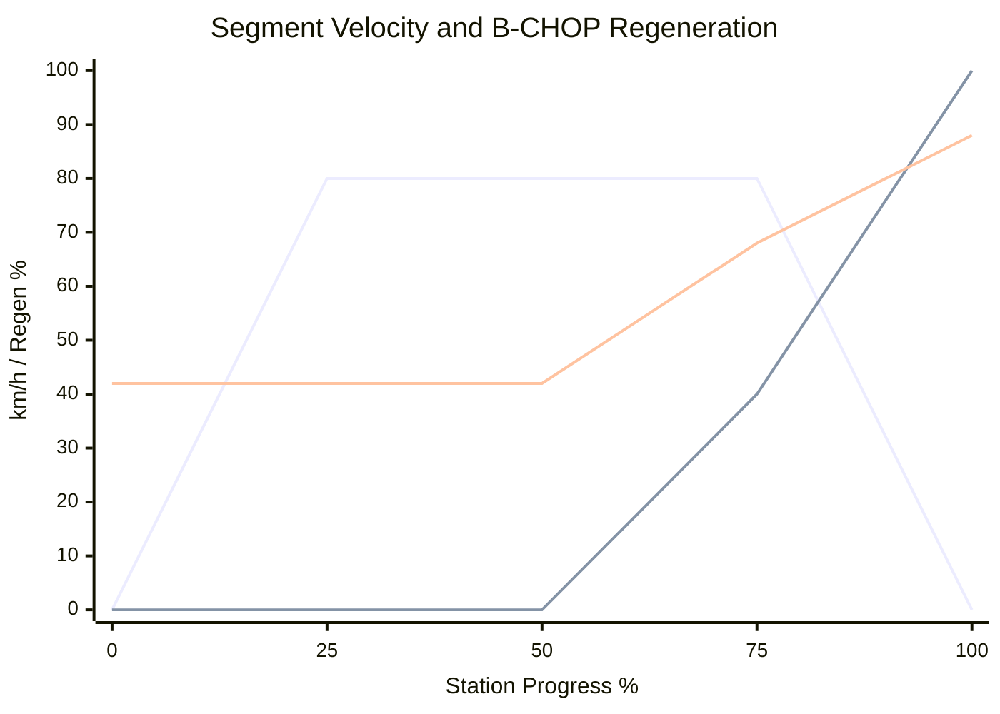
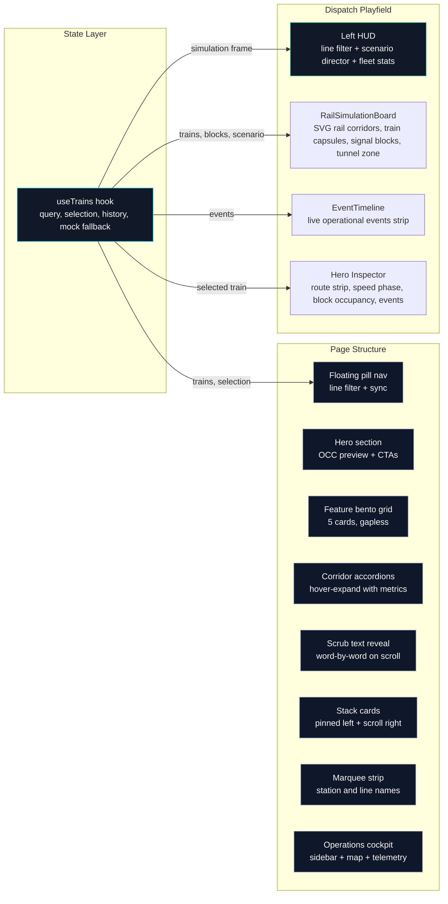
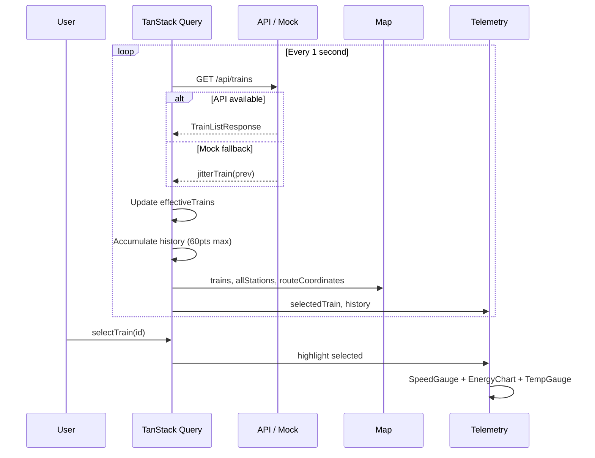

# HMAX-Lite Architecture Documentation

## System Overview

HMAX-Lite is a real-time Digital Twin simulation for the Panama Metro system covering Lines 1, 2, and 3. It demonstrates SCADA-style monitoring capabilities for transit operations with 13 trains across 39 stations.

## Architecture Diagram


```mermaid
flowchart TB
    subgraph Runtime["Docker Compose or local dev"]
        subgraph Frontend["Frontend: React 18 + TypeScript + Vite"]
            App["App shell\n2.5D OCC dispatch playfield"]
            Query["TanStack Query v5\n1s polling, retry once"]
            Mock["Mock telemetry fallback\nroute progress, dwell, reversal, tunnel relay"]
            Sim["Simulation layer\nscenarios, events, signal blocks, prompts"]
            GSAP["GSAP + ScrollTrigger\nHUD panel entrance, pinned sections"]
            UI["RailSimulationBoard + EventTimeline + Hero Inspector"]
        end

        subgraph Backend["Backend: FastAPI"]
            API["REST endpoints\n/health, /api/lines, /api/trains, /api/stations, /api/stream"]
            Engine["Train simulator\nHaversine, interpolation, accel, decel"]
            Telemetry["Telemetry model\nspeed, motor current, B-CHOP, temp, doors"]
            Geofence["Line 3 tunnel geofence\nBalboa to Panama Pacifico"]
            Stations["Station data\n39 stations across 3 lines"]
        end
    end

    App --> Query --> UI
    Query -->|"HTTP"| API
    Query -.->|"API unavailable or VITE_USE_MOCK=true"| Mock
    Mock --> Sim
    Sim --> UI
    App --> GSAP
    GSAP -->|"panel entrance"| UI
    API --> Engine
    Engine --> Stations
    Engine --> Telemetry
    Engine --> Geofence
    Telemetry --> API
    Geofence --> API

    classDef shell fill:#0f172a,stroke:#22d3ee,color:#fff
    classDef service fill:#111827,stroke:#34d399,color:#fff
    classDef signal fill:#111827,stroke:#fbbf24,color:#fff
    classDef motion fill:#111827,stroke:#d7ff5f,color:#fff
    class App,Query,UI,Mock,GSAP shell
    class API,Engine,Stations service
    class Telemetry,Geofence signal
```

## Network Topology


```mermaid
flowchart LR
    subgraph Line1["Line 1: North-South Corridor"]
        L1_T1["San Isidro\nTerminal"] --> L1_02["Villa Zaita"]
        L1_02 --> L1_03["El Crisol"]
        L1_03 --> L1_04["Brisas del Golf"]
        L1_04 --> L1_05["Cerro Viento"]
        L1_05 --> L1_06["San Antonio"]
        L1_06 --> L1_07["Pedregal"]
        L1_07 --> L1_08["Pueblo Nuevo"]
        L1_08 --> L1_09["12 de Octubre"]
        L1_09 --> L1_10["Iglesia del Carmen"]
        L1_10 --> L1_11["Via Argentina"]
        L1_11 --> L1_12["Fdez de Cordoba"]
        L1_12 --> L1_13["El Ingenio"]
        L1_13 --> L1_15["Albrook\nInterchange"]
    end

    subgraph Line3["Line 3: West Corridor"]
        L3_01["Albrook\nTerminal"] --> L3_02["Balboa\nTunnel Entry"]
        L3_02 -.->|"TUNNEL RELAY"| L3_03["Panama Pacifico\nTunnel Exit"]
        L3_03 --> L3_04["Loma Cova"]
        L3_04 --> L3_05["Arraijan"]
        L3_05 --> L3_06["Nuevo Chorrillo"]
        L3_06 --> L3_07["Vista Alegre"]
        L3_07 --> L3_08["Burunga"]
        L3_08 --> L3_09["Nuevo Arraijan"]
        L3_09 --> L3_10["San Bernardino"]
        L3_10 --> L3_11["Ciudad del Futuro\nTerminal"]
    end

    L1_15 -.->|"Interchange"| L3_01

    classDef terminal fill:#0f172a,stroke:#fbbf24,color:#fff
    classDef tunnel fill:#0f172a,stroke:#22d3ee,color:#fff
    classDef station fill:#111827,stroke:#94a3b8,color:#fff
    classDef interchange fill:#111827,stroke:#d7ff5f,color:#fff
    class L1_T1,L3_01,L3_11 terminal
    class L3_02,L3_03 tunnel
    class L1_15 interchange
```

## Component Details

### Backend: Train Simulator (`simulator.py`)

**Tech Stack:**
- **Python 3.11+** (Docker uses `python:3.11-slim`)
- **FastAPI**
- **Pydantic** (Strict data validation)
- **SSE-Starlette** (Real-time events)

The physics engine simulates realistic train behavior:

**Speed Profile (Trapezoidal Velocity):**


```mermaid
xychart-beta
    title "Segment Velocity and B-CHOP Regeneration"
    x-axis "Station Progress %" [0, 25, 50, 75, 100]
    y-axis "km/h / Regen % " 0 --> 100
    line "Speed" [0, 80, 80, 80, 0]
    line "B-CHOP Active" [0, 0, 0, 40, 100]
    line "Brake Temp" [42, 42, 42, 68, 88]
```

- 0-25%: Acceleration phase (0 to 80 km/h)
- 25-75%: Cruise at 80 km/h
- 75-100%: Deceleration phase (80 to 0 km/h)
- Station dwell: 12-15 seconds
- Terminal reversal: automatic direction swap

**B-CHOP Regenerative Braking:**
- Activates when `progress > 75%` (approaching station)
- Energy recovery rate: ~0.15 kWh/second during braking
- Temperature increases during active braking (40C-90C range)
- Temperature cools passively outside braking window

**Tunnel Geofencing:**
- Tunnel section: Balboa (ST-02) to Panama Pacifico (ST-03)
- When in tunnel:
  - `is_in_tunnel: true`
  - `comms_mode: "TUNNEL_RELAY"`
  - UI shows cyan tunnel indicators
  - Map renders dashed cyan line overlay

### Frontend: Operations Dashboard

**Technology Stack:**
- **Node.js 18+**
- **Vite 5+** (Build tool)
- **React 18** with TypeScript
- **TanStack Query v5** for data fetching
- **Leaflet** + React-Leaflet for mapping
- **Recharts** for data visualization
- **Tailwind CSS 3.4** for styling
- **GSAP + ScrollTrigger** for scroll motion
- **Outfit** (UI) + **JetBrains Mono** (data) font stack

**Component Hierarchy:**


```mermaid
flowchart LR
    subgraph Data["State Layer"]
        Hook["useTrains hook\nquery, selection, history, mock fallback"]
    end

    subgraph Page["Page Structure"]
        Nav["Floating pill nav\nline filter + sync"]
        Hero["Hero section\nOCC preview + CTAs"]
        Bento["Feature bento grid\n5 cards, gapless"]
        Accordion["Corridor accordions\nhover-expand with metrics"]
        Scrub["Scrub text reveal\nword-by-word on scroll"]
        Stack["Stack cards\npinned left + scroll right"]
        Marquee["Marquee strip\nstation and line names"]
        Ops["Operations cockpit\nsidebar + map + telemetry"]
    end

    subgraph Cockpit["Dispatch Playfield"]
        Sidebar["Left HUD\nline filter + scenario director + fleet stats"]
        Board["RailSimulationBoard\nSVG rail corridors, train capsules, signal blocks, tunnel zone"]
        Events["EventTimeline\nlive operational events strip"]
        Inspector["Hero Inspector\nroute strip, speed phase, block occupancy, events"]
    end

    Hook -->|"trains, selection"| Nav
    Hook -->|"simulation frame"| Sidebar
    Hook -->|"trains, blocks, scenario"| Board
    Hook -->|"events"| Events
    Hook -->|"selected train"| Inspector

    classDef state fill:#111827,stroke:#22d3ee,color:#fff
    classDef page fill:#0f172a,stroke:#94a3b8,color:#fff
    classDef ops fill:#111827,stroke:#34d399,color:#fff
    class Hook state
    class Nav,Hero,Bento,Accordion,Scrub,Stack,Marquee,Ops page
    class Sidebar,Fleet,MapComp,Telemetry ops
```

**Simulation State Derivation (Frontend-Only):**

The console derives richer UI state from existing `TrainStatus` objects without backend changes:

| Derived State | Source | Visual Output |
|---------------|--------|---------------|
| `speed_phase` | speed + at_station + b_chop_status | Phase badges: accelerate / cruise / brake / dwell |
| `tunnel_phase` | line + current/next station + progress | Tunnel approach / inside / exit highlighting |
| `braking_phase` | progress + at_station | none / initial / heavy / regen indicators |
| `block_occupancy` | progress + scenario factor | Signal block color: clear / approach / occupied / restricted |
| `recent_events` | prev vs curr train comparison | Event timeline entries |
| `operator_prompts` | train state + line density | Contextual decision cards |

**Mock Telemetry State Machine:**

```mermaid
stateDiagram-v2
    [*] --> Moving: initialized
    Moving --> Accelerating: progress < 22%
    Accelerating --> Cruising: progress >= 22%
    Cruising --> Braking: progress > 76%
    Braking --> AtStation: progress reaches 100%
    AtStation --> Moving: dwell countdown ends

    Moving --> TunnelRelay: Line 3 AND current=ST-02 AND next=ST-03
    TunnelRelay --> AtStation: progress reaches 100% at ST-03
    AtStation --> ReverseDirection: terminal station reached
    ReverseDirection --> Moving: dwell countdown ends

    note right of Accelerating: speed: 24-65 km/h
    note right of Cruising: speed: 70-78 km/h
    note right of Braking: B-CHOP active, temp rising
    note right of TunnelRelay: comms_mode: TUNNEL_RELAY
```

**Scenario Director:**

Six simulation modes change visible state:
- `normal` — standard operations
- `rush_hour` — compressed headways, higher event frequency
- `tunnel_degraded` — reduced comms capacity, intensified tunnel highlighting
- `bchop_peak` — maximized regenerative braking events
- `dwell_delay` — extended station stops
- `signal_hold` — controlled block occupancy management

**Flagship Demo Mode:**

A one-click "Run Flagship Scenario" auto-sequences through:
1. Select Line 3
2. Follow LINE3-002 (tunnel train)
3. Highlight signal blocks
4. Trigger tunnel relay state
5. Show B-CHOP braking event
6. Log operational events to timeline
7. End with system summary

**Data Flow:**


```mermaid
sequenceDiagram
    participant U as User
    participant Q as TanStack Query
    participant A as API / Mock
    participant M as Map
    participant T as Telemetry

    loop Every 1 second
        Q->>A: GET /api/trains
        alt API available
            A-->>Q: TrainListResponse
        else Mock fallback
            A-->>Q: jitterTrain(prev)
        end
        Q->>Q: Update effectiveTrains
        Q->>Q: Accumulate history (60pts max)
        Q->>M: trains, allStations, routeCoordinates
        Q->>T: selectedTrain, history
    end

    U->>Q: selectTrain(id)
    Q->>T: highlight selected
    T->>T: SpeedGauge + EnergyChart + TempGauge
```

**Offline/mock mode:**
- The API client falls back to frontend mock data if the backend is unavailable.
- `VITE_USE_MOCK=true` forces mock telemetry for frontend-only demos.
- Mock trains advance through station segments, dwell at stations, reverse at terminals, and surface Line 3 tunnel relay state.

## Design System

### Visual Principles
- Operations-control surface, NOT a generic SaaS landing page
- Dark industrial SCADA aesthetic with `#05070a` base
- Accent colors: `#d7ff5f` (lime), `#22d3ee` (cyan/tunnel), `#fbbf24` (amber/brake)
- Line colors: Line 1 `#ef4444` (red), Line 2 `#22c55e` (green), Line 3 `#3b82f6` (blue)
- Font stack: Outfit (display) + JetBrains Mono (data/labels)
- High-contrast controls on dark surfaces
- No purple/AI-blue gradients, no neon outer glows, no emojis

### GSAP Motion Layers
| Section | Animation | Trigger |
|---------|-----------|---------|
| Hero | Y-stagger fade-in | Load |
| Feature cards | Scale 0.86->1, brightness scrub | Scroll (scrub) |
| Corridor accordions | Flex expand on hover | Hover |
| Scrub reveal | Word-by-word opacity 0.14->1 | Scroll (scrub) |
| Stack cards | Y-translate + scale, stacking | Scroll (scrub) |
| Marquee | Infinite xPercent -50 | Load (loop) |
| Command sidebar | Pin left while right scrolls | Scroll (pin) |

## Performance Considerations

- **Frontend:** GSAP hardware-accelerated transforms only (no top/left/width/height animations)
- **Backend:** Single-threaded event loop handles multiple concurrent clients
- **Memory:** History limited to 60 points per train (~5KB per train)
- **Network:** ~2KB JSON payload per poll request
- **CSS:** Grain/scanline overlays use `pointer-events: none` fixed elements (no scroll repaint)

## Extension Points

1. **Authentication:** Add JWT-based auth for production
2. **Database:** Persist telemetry to TimescaleDB for historical analysis
3. **Alerts:** Add rule engine for anomaly detection
4. **Multi-line:** Extend simulator for additional metro lines
5. **MQTT:** Replace HTTP polling with MQTT for true real-time

## Deployment

### Local Development (Manual)

**Backend:**
```bash
cd backend
python3 -m venv venv
source venv/bin/activate
pip install -r requirements.txt
python3 -m uvicorn main:app --reload --port 8000
```

**Frontend:**
```bash
cd frontend
npm install
npm run dev
```

### Docker (Optional)

```bash
docker-compose up --build
```

Access points:
- Dashboard: http://localhost:3000
- API Docs: http://localhost:8000/docs
- Health: http://localhost:8000/health
