# HMAX-Lite Architecture Documentation

## System Overview

HMAX-Lite is a real-time Digital Twin simulation for the Panama Metro Line 3 monorail system. It demonstrates SCADA-style monitoring capabilities for transit operations.

## Architecture Diagram

```mermaid
flowchart TB
    subgraph Docker["🐳 Docker Compose Environment"]
        subgraph Client["🌐 Browser (Client)"]
            subgraph UI["React 18 + TypeScript + Tailwind CSS"]
                MV["🗺️ Map View (Leaflet)<br/>• Route • Stations • Trains"]
                TL["🚇 Train List<br/>5 Active Trains"]
                TS["📊 Telemetry Sidebar<br/>• Speed Gauge<br/>• Energy Chart<br/>• Temp Gauge"]
            end
            TQ["TanStack Query (Polling)"]
        end
        
        Client -->|"HTTP/SSE (1s polling)"| Backend
        
        subgraph Backend["⚙️ Backend (FastAPI)"]
            subgraph Engine["Train Simulator Engine"]
                PM["📐 Physics Model<br/>• Haversine<br/>• Interpolate<br/>• Accel/Decel"]
                TGN["📈 Telemetry Gen<br/>• Speed<br/>• B-CHOP<br/>• Energy"]
                GF["📍 Geofencing<br/>• Tunnel<br/>• Comms Mode<br/>• Boundaries"]
            end
            SD["🚉 Station Data: 11 stations from Albrook to Ciudad del Futuro"]
            EP["API Endpoints:<br/>GET /api/trains<br/>GET /api/trains/:id<br/>GET /api/stations<br/>GET /api/stream"]
        end
    end
    
    style Docker fill:#1a1a2e,stroke:#16213e,color:#fff
    style Client fill:#162447,stroke:#00d9ff,color:#fff
    style Backend fill:#0f3460,stroke:#e94560,color:#fff
    style Engine fill:#1f4068,stroke:#1b1b2f,color:#fff
    style UI fill:#1f4068,stroke:#00d9ff,color:#fff
```



## Component Details

### Backend: Train Simulator (`simulator.py`)

**Tech Stack:**
- **Python 3.14+**
- **FastAPI 0.128+**
- **Pydantic v2** (Strict data validation)
- **SSE-Starlette** (Real-time events)

The physics engine simulates realistic train behavior:

**Position Interpolation:**
- Uses Haversine formula for accurate GPS distance calculations
- Linear interpolation between station coordinates
- Heading calculated from movement direction

**Speed Profile (Trapezoidal Velocity):**


- 0-25%: Acceleration phase
- 25-75%: Cruise at 80 km/h
- 75-100%: Deceleration phase
- Station dwell: 15 seconds

**B-CHOP Regenerative Braking:**
- Activates when `progress > 75%` (approaching station)
- Energy recovery rate: ~0.15 kWh/second during braking
- Temperature increases during active braking (40°C - 90°C range)

**Tunnel Geofencing:**
- Tunnel section: Balboa (ST-02) to Panama Pacifico (ST-03)
- When in tunnel:
  - `is_in_tunnel: true`
  - `comms_mode: "TUNNEL_RELAY"`
  - UI shows purple indicators

### Frontend: Operations Dashboard

**Technology Stack:**
- **Node.js 18+**
- **Vite 5+** (Build tool)
- **React 18** with TypeScript
- **TanStack Query v5** for data fetching
- **Leaflet** + React-Leaflet for mapping
- **Recharts** for data visualization
- **Tailwind CSS 3.4** for styling

**Component Hierarchy:**


**Data Flow:**
1. `useTrains` hook polls `/api/trains` every 1 second
2. Train positions update on map
3. Selected train telemetry displays in sidebar
4. History accumulated for charts (60 data points max)

## Key Engineering Decisions

### 1. Polling vs WebSockets
Chose polling (1s interval) for simplicity and robust connection handling in MVP. SSE (Server-Sent Events) endpoint `/api/stream` is implemented for future real-time upgrades.

### 2. State Management
TanStack Query handles server state with automatic caching and background updates. Local state (selection, history) managed with React hooks.

### 3. Dependency Management
- **Backend:** Uses `venv` with unpinned `requirements.txt` to ensure compatibility with latest Python versions (tested on 3.14).
- **Frontend:** Standard `npm` workflow with modern Vite scaffolding.

## Performance Considerations

- **Frontend:** Uses `requestAnimationFrame` for smooth marker animations
- **Backend:** Single-threaded event loop handles multiple concurrent clients
- **Memory:** History limited to 60 points per train (~5KB per train)
- **Network:** ~2KB JSON payload per poll request

## Extension Points

1. **Authentication:** Add JWT-based auth for production
2. **Database:** Persist telemetry to TimescaleDB for historical analysis
3. **Alerts:** Add rule engine for anomaly detection
4. **Multi-line:** Extend simulator for additional metro lines
5. **MQTT:** Replace HTTP polling with MQTT for true real-time

## Deployment

### Local Development (Manual)

**Backend:**
```bash
cd backend
python3 -m venv venv
source venv/bin/activate
pip install -r requirements.txt
python3 -m uvicorn main:app --reload --port 8000
```

**Frontend:**
```bash
cd frontend
npm install
npm run dev
```

### Docker (Optional)

```bash
docker-compose up --build
```

Access points:
- Dashboard: http://localhost:3000
- API Docs: http://localhost:8000/docs
